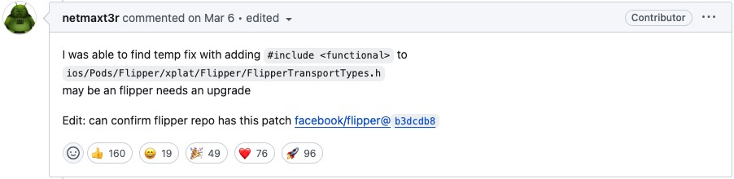

## react-native-demo

主分支基于`react-native@0.68.7`，配置了`ts`和`@alias`，继承了常用的三方插件：`react-navigation`，`zustand`、`react-native-debugger`、`axios`。

为什么选择此分支？

在`0.69`及以后，官方修改了`Android`的渲染器，移除了`Flipper`以及`Remote JS Debug`，自带的调试器功能太过鸡肋，截止`0.74.3`仍然不能调试网络，所以选择的`0.69`最近的一个版本：`0.68.7`。

## 常见问题

### iOS Flipper 报错

https://github.com/facebook/react-native/issues/43335



### FBReactNativeSpec

```bash
Command PhaseScriptExecution failed with a nonzero exit code.
```

我看网上说是官方的脚本和`nvm`是绑定起来的 ...

```bash
nvm unalias default
nvm alias default node
```
